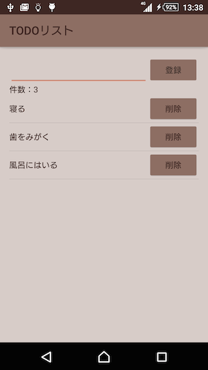

# android-butterknife-viewcontroller-sample

## Use library

- [Butter Knife (ver 7.0.1)](http://jakewharton.github.io/butterknife/)
- [EventBus (ver 2.4.0)](https://github.com/greenrobot/EventBus)
- [Realm (ver 0.81.1)](https://realm.io/)
- [Android Support Library (ver 23.0.1)](https://developer.android.com/intl/ja/tools/support-library/index.html)
- [android-apt (ver 1.8)](https://bitbucket.org/hvisser/android-apt)
